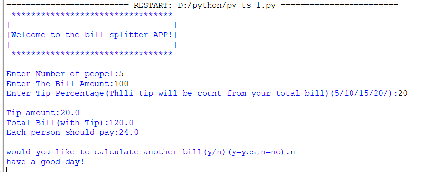
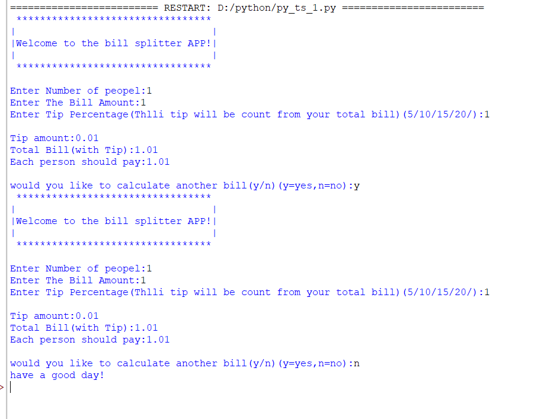
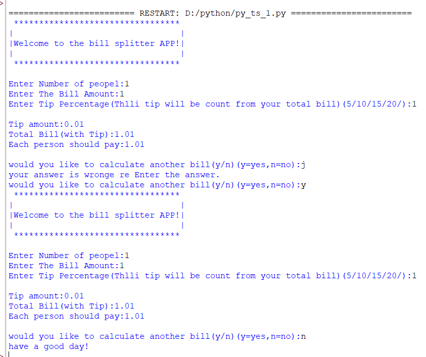

# 💰 Bill Splitter App


A simple, fun, and easy-to-use **command-line Python application** that helps you split a restaurant bill among friends — tip included! 🍽️

---

## 📖 About the Project

**Bill Splitter App** is a simple command-line Python application that helps users split a restaurant bill among multiple people. The program also calculates the tip based on a user-selected percentage and displays:

- 💵 Tip amount
- 🧾 Total bill including tip
- 🤝 Amount each person should pay

The application also allows users to calculate another bill without restarting the program, thanks to a built-in loop.

---

## ✨ Features

- 🖥️ User-friendly command-line interface
- 💸 Calculates tip amount automatically
- 🧾 Calculates total bill (with tip included)
- 👥 Splits the bill equally among all people
- ✅ Input validation for bill amount
- 🔁 Repeat calculation option — no need to restart the program
- 🐍 Simple and beginner-friendly Python code

---

## 🛠️ Technologies Used

- **Python 3**
- **Command Line Interface (CLI)**

---

## 📂 Project Structure

```text
python-test/
│── py_ts_1.py
│── output1.png
│── output2.png
│── output3.png
│── README.md
```

---

## 🖼️ Output Screenshots

### Output 1


### Output 2


### Output 3


---

## ⚙️ Installation

Follow these steps to get a copy of the project running on your local machine:

1. **Clone the repository**
   ```bash
   git clone https://github.com/dhyeykakadiya71-dotcom/python-exam.git
   ```

2. **Open the project folder**
   ```bash
   cd "python-exam/python  test"
   ```

3. **Run the program using Python** (see [How to Run](#-how-to-run) below)

---

## ▶️ How to Run

Make sure you have **Python 3** installed, then run:

```bash
python py_ts_1.py
```

Or, depending on your system setup:

```bash
python3 py_ts_1.py
```

---

## 🔄 Example Workflow

Here's how the app works, step by step:

1. 👥 Enter the number of people splitting the bill.
2. 💵 Enter the total bill amount.
3. 💯 Enter the tip percentage (e.g., 5, 10, 15, or 20).
4. 📊 View the calculated tip amount.
5. 🧾 View the total bill (including tip).
6. 🤝 View how much each person should pay.
7. 🔁 Choose whether to calculate another bill (`y` for yes, `n` for no).

---

## 🚀 Future Improvements

Planned features and ideas to make this project even better:

- 🔍 Better input validation and error handling
- 🎯 Custom (user-defined) tip percentage
- 💱 Currency symbol support
- 🧾 Receipt generation (save as text or PDF)
- 🖼️ GUI version using **Tkinter**
- 📜 Save bill history for future reference

---

## 👤 Author

**Dhyey Kakadiya**

🔗 GitHub: [dhyeykakadiya71-dotcom/python-exam](https://github.com/dhyeykakadiya71-dotcom/python-exam/tree/main/python%20%20test)

---

⭐ If you found this project helpful, consider giving it a star on GitHub!
